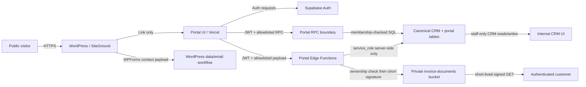

# Data Flow And Trust Boundaries

Date: 2026-07-23
Scope: CP-0 / CP-1

## System map



## Trust boundaries

| Boundary | Input is untrusted | Required control |
| --- | --- | --- |
| Internet to WordPress | form fields, cookies, URLs | WP updates, WAF/rate limit, spam control, layered privacy, consent configuration |
| WordPress to portal | navigation URL and referrer | no identity/data handoff; HTTPS canonical link only |
| Browser to Auth | email, password, OTP, recovery token | generic errors, verified redirects, CAPTCHA/rate limits, email verification, secure session handling |
| Browser to portal API | JWT, IDs, filters, notes | server-side membership, role and row checks; schemas and length limits; no trust in JWT metadata supplied by client |
| Portal boundary to CRM | client/property/job/invoice lookups | least-privilege RPC/Edge output; explicit client join; no generic table proxy |
| Portal boundary to Storage | invoice ID | membership + invoice ownership recheck; opaque object key; short expiry; audit |
| Internal CRM to canonical data | authenticated staff session | explicit internal staff authorization; current any-authenticated policy must be removed |
| Vendor transfer | customer and telemetry data | Article 28 terms, region/subprocessor inventory, transfer mechanism and minimisation |

## Core data flows

### Invitation-first existing client

1. Staff authenticates in the internal CRM and selects the exact canonical `clients.id`.
2. Trusted server creates an invitation with random 256-bit token; only a peppered hash is stored.
3. Email contains the one-time token. Logs contain invitation ID only.
4. Invitee verifies email and authenticates.
5. Edge validates token hash, expiry, unused/revoked state, authenticated user and verified email.
6. One transaction consumes the invitation and creates the exact membership.
7. Audit records actor, invitation ID, client ID, result and timestamps, not the raw token.

Email matching is only a consistency check against the invitation. It never selects a CRM client.

### Open registration

1. User registers and verifies email.
2. Edge creates `client_portal_applications.status = pending_review`.
3. No membership is created; all business RPCs return the same generic empty/forbidden response.
4. Staff reviews identity and selects or creates the client through the existing internal workflow.
5. Staff approval creates an exact membership transaction and records evidence.

### Portal read

1. Browser calls one allowlisted endpoint with an Auth access token and explicit client context.
2. Server resolves `auth.uid()` and one active membership for that client.
3. Query joins canonical rows through `client_id` and filters archived/deleted/internal fields.
4. Response returns only its endpoint schema.
5. Cross-client, unknown and absent IDs produce indistinguishable `not_found` responses.

### Service request

1. Active member selects an allowed property belonging to the same client.
2. RPC validates fields and rate limit, then inserts a request in `requested`.
3. Staff reviews it in CRM and may reject, quote or create a job through existing internal paths.
4. `approved_job_id` is set only by internal workflow.
5. The request never calls `save_job_with_lines`, invoice or payment RPCs.

### Invoice document

1. Portal lists minimal invoice metadata from canonical invoices.
2. Customer asks Edge for a download using invoice ID.
3. Edge rechecks active membership, invoice client, allowed status and document record.
4. Edge signs an opaque private object key for 60 seconds, single download intent.
5. Storage access and result are audited. The response is `not_found` for every ownership failure.

## Canonical relationships

```text
auth.users
  -> client_portal_memberships -> clients
                                  -> properties
                                  -> quotes -> quote_lines
                                  -> jobs -> job_lines
                                  -> invoices -> invoice_lines
                                              -> payments

client_service_requests -> clients
                        -> properties
                        -> auth.users (requested_by)
                        -> jobs (approved_job_id, internal-only transition)
```

## Data egress limits

- No payroll, expenses, closing snapshots, audit payloads, lead drafts or other-client records.
- No internal notes, pricing metadata, margins, supplier data or operational incident details.
- No raw storage path, persistent document URL, token, secret, Auth administrative field or service-role response.
- Browser telemetry must not contain names, emails, addresses, tax identifiers, invoice contents or request notes.

## Website integration findings

- Current public website forms are WordPress-local WPForms, not integrated with Supabase.
- Current public forms collect personal/contact data but do not render the required first privacy layer.
- Complianz is present and exposes Accept, Deny and Preferences, but the policy inventory includes unresolved cookies and inconsistent contact details.
- CP-4 must keep website form records separate from portal memberships and must not use a form email as proof of client identity.
